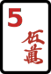
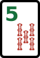

# Mahjong Basics

This page is a short introduction to Japanese riichi mahjong for newcomers.
MahJax ships with two tile sets:

- `ja`: the original tile faces
- `en`: an English-friendly tile set with the same game information

The first half of this page shows both side by side, so you can learn the game and the tile notation at the same time.

## 1. Reading the tiles

Riichi mahjong uses **34 tile types**.
There are **4 copies** of each type, so a full set has **136 tiles**.

### The three suits

The numbered suits are:

- **Characters (manzu)** (`m`)
- **Circles (pinzu)** (`p`)
- **Bamboos (souzu)** (`s`)

| Group | Original tiles | English tiles |
| --- | --- | --- |
| Characters (manzu) | { width="34" } { width="34" } { width="34" } { width="34" } { width="34" } { width="34" } { width="34" } { width="34" } { width="34" } | { width="34" } { width="34" } { width="34" } { width="34" } { width="34" } { width="34" } { width="34" } { width="34" } { width="34" } |
| Circles (pinzu) | { width="34" } { width="34" } { width="34" } { width="34" } { width="34" } { width="34" } { width="34" } { width="34" } { width="34" } | { width="34" } { width="34" } { width="34" } { width="34" } { width="34" } { width="34" } { width="34" } { width="34" } { width="34" } |
| Bamboos (souzu) | { width="34" } { width="34" } { width="34" } { width="34" } { width="34" } { width="34" } { width="34" } { width="34" } { width="34" } | { width="34" } { width="34" } { width="34" } { width="34" } { width="34" } { width="34" } { width="34" } { width="34" } { width="34" } |

### Honor tiles

Honor tiles are not numbered.
They are the four winds and the three dragons.

| Group | Original tiles | English tiles |
| --- | --- | --- |
| Winds | { width="34" } { width="34" } { width="34" } { width="34" } | { width="34" } { width="34" } { width="34" } { width="34" } |
| Dragons | { width="34" } { width="34" } { width="34" } | { width="34" } { width="34" } { width="34" } |

### Red fives

Some rulesets include one special red 5 in each suit.
MahJax can visualize those too.

| Group | Original tiles | English tiles |
| --- | --- | --- |
| Red fives | { width="34" } { width="34" } { width="34" } | { width="34" } { width="34" } { width="34" } |

## 2. Building combinations

Most winning hands in riichi mahjong are built from:

- **4 melds** (`mentsu`)
- **1 pair**

The three basic building blocks are:

| Unit | Original tiles | English tiles | Meaning |
| --- | --- | --- | --- |
| Sequence | <nobr>{ width="34" } { width="34" } { width="34" }</nobr> | <nobr>{ width="34" } { width="34" } { width="34" }</nobr> | Three consecutive suit tiles. Honors cannot make sequences. |
| Triplet | <nobr>{ width="34" } { width="34" } { width="34" }</nobr> | <nobr>{ width="34" } { width="34" } { width="34" }</nobr> | Three identical tiles. |
| Pair | <nobr>{ width="34" } { width="34" }</nobr> | <nobr>{ width="34" } { width="34" }</nobr> | Two identical tiles. A regular winning hand needs exactly one pair. |

Here is a complete standard hand:

| Tile set | Hand |
| --- | --- |
| JA | <nobr>{ width="34" } { width="34" } { width="34" } { width="34" } { width="34" } { width="34" } { width="34" } { width="34" } { width="34" } { width="34" } { width="34" } { width="34" } { width="34" } { width="34" }</nobr> |
| EN | <nobr>{ width="34" } { width="34" } { width="34" } { width="34" } { width="34" } { width="34" } { width="34" } { width="34" } { width="34" } { width="34" } { width="34" } { width="34" } { width="34" } { width="34" }</nobr> |

This hand is:

- `123m`
- `456m`
- `789p`
- `777s`
- `east east`

!!! note "Exceptions exist"
    The standard shape is `4 melds + 1 pair`, but famous exceptions such as **Seven Pairs** and **Thirteen Orphans** also exist.

### How a turn works

At a high level, every turn is simple:

1. Draw one tile.
2. Check whether the hand is now ready or complete.
3. Discard one tile.

Other players may claim the discard:

- **chi**: take the previous player's discard to make a sequence
- **pon**: take any player's discard to make a triplet
- **kan**: make a four-of-a-kind
- **ron**: win on another player's discard

If you complete your own hand on your draw, that win is **tsumo**.

## 3. Winning hands and yaku

In riichi mahjong, a complete shape is **not enough**.
To win, you normally need:

- a complete hand
- at least one **yaku** (a scoring pattern or winning condition)

For beginners, the three most useful yaku to learn first are:

- **riichi**
- **tanyao**
- **yakuhai**

From this section onward, the examples use the English tiles only.

### Tanyao: all simples

{ width="34" } { width="34" } { width="34" }
{ width="34" } { width="34" } { width="34" }
{ width="34" } { width="34" } { width="34" }
{ width="34" } { width="34" } { width="34" }
{ width="34" } { width="34" }

This hand contains only suit tiles from **2 to 8**.
No terminals (`1` or `9`) and no honors appear, so it qualifies for **tanyao**.

### Yakuhai: value honor triplet

{ width="34" } { width="34" } { width="34" }
{ width="34" } { width="34" } { width="34" }
{ width="34" } { width="34" } { width="34" }
{ width="34" } { width="34" } { width="34" }
{ width="34" } { width="34" }

A triplet of dragons is a basic yaku.
This is one of the easiest yaku to recognize at a glance.

### Riichi: closed hand in ready state

Tenpai shape:

{ width="34" } { width="34" } { width="34" }
{ width="34" } { width="34" } { width="34" }
{ width="34" } { width="34" } { width="34" }
{ width="34" } { width="34" } { width="34" }
{ width="34" }

Waiting tile:

{ width="34" }

If this hand is **closed** and you declare **riichi** while waiting on `5p`, then a later win on `5p` is legal because riichi itself is the yaku.

### Two core ideas to remember

- A hand can look complete, but it still needs a yaku.
- Calling tiles makes some hands easier to finish, but it also removes some yaku. For example, **riichi** only works with a closed hand.

## 4. Where to learn the full rules

This page only covers the core ideas.
For the full rules, scoring details, and corner cases, the best next reference is:

- [European Mahjong Association: Riichi Rules 2025 (official PDF)](https://mahjong-europe.org/portal/images/docs/Riichi-rules-2025-EN.pdf)

If you want the MahJax-specific summary of supported rules, see [Rules](rule.md).

## 5. Where to play online

If you want to practice after reading the basics, these are good starting points:

- [Tenhou](https://tenhou.net/): long-running competitive platform. The interface is still Japanese-first, but it is one of the most established places to play riichi mahjong online.
- [Mahjong Soul on Steam](https://store.steampowered.com/app/2739990/Mahjong_Soul/): polished client, native English interface, and a built-in tutorial.
- [Riichi City on Steam](https://store.steampowered.com/app/1954420/RiichiCity/): another English-friendly client with ranked play.
- [Riichi.Wiki: Playing online](https://riichi.wiki/index.php?mobileaction=toggle_view_desktop&title=Playing_online): practical English notes comparing online clients, including Tenhou, Mahjong Soul, and Riichi City.
